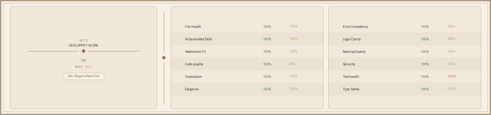

# ✨ NewTab - 美观且极简的新标签页

<div align="center">
  
  
  <p>
    一款美观、高度可定制且无干扰的 Chrome 新标签页扩展。
    <br />
    旨在为您的浏览体验带来平静与专注。
  </p>

  [](https://opensource.org/licenses/MIT)
  [](https://react.dev/)
  [](https://www.typescriptlang.org/)
  [](https://vitejs.dev/)
  [](https://tailwindcss.com/)
</div>

## 🎨 功能特性

- **极简设计**：清爽的界面，带有磨砂玻璃（背景模糊）效果。
- **高质量壁纸**：
    - 🔄 **每日 Bing 壁纸**：自动同步每日精美图片。
    - 🔗 **自定义 URL**：使用任意图片 URL 作为背景。
    - 💧 **模糊控制**：调节背景模糊度以提高文字可读性。
- **智能链接管理**：
    - 📁 **分组**：将您喜爱的网站整理到不同的标签/分组中。
    - 🖱️ **拖放排序**：轻松重新排列链接和分组（由 `dnd-kit` 驱动）。
    - 📌 **书签导入**：一键从浏览器书签导入（仅限扩展程序模式）。
- **全能搜索**：即时切换 Google、Bing 和 百度搜索引擎。
- **实用工具箱**：
    - ⏱️ **番茄钟**：专注工作，支持自定义音效提醒（可开关）。
    - 🔢 **Base64 转换**：文本与 Base64 快速互转。
    - 🕒 **时间戳工具**：Unix 时间戳与日期格式互转。
    - 📄 **JSON 工具**：JSON 格式化、压缩与校验。
    - 📱 **二维码生成**：文本/链接生成二维码，支持扫描。
- **同步**：跨设备同步您的设置。

## 🛠️ 技术栈

使用现代 Web 技术构建，兼顾性能与开发体验：

- **React 19**：用于构建 Web 和原生用户界面的最新库。
- **TypeScript**：提供类型安全的代码和更好的重构体验。
- **Vite**：闪电般的构建工具和开发服务器。
- **Tailwind CSS**：实用优先的 CSS 框架，用于快速 UI 开发。
- **dnd-kit**：轻量、高性能、无障碍的 React 拖放工具包。

## 🚀 快速开始

您可以选择直接下载安装使用，也可以克隆源码进行二次开发。

### 📥 方式一：直接安装（推荐用户）

如果您不打算修改代码，可以直接下载构建好的文件：

1.  **获取扩展程序**：
    前往 [Releases](https://github.com/Mei-Nagano/NewTab/releases) 页面下载最新发布的资源包 (`NewTab.zip`) 并解压。
2.  **安装到 Chrome**：
    1.  打开 Chrome 浏览器，访问 `chrome://extensions/`。
    2.  在右上角开启 **“开发者模式” (Developer mode)**。
    3.  点击 **“加载已解压的扩展程序” (Load unpacked)**。
    4.  选择 Releases 解压后的文件夹`NewTab-vx.x.x`（或方式二中构建的 `dist` 文件夹）。
    5.  完成！打开新标签页即可体验。

### 💻 方式二：本地开发构建

如果您是开发者，想要修改功能或自行构建：

#### 1. 前置要求
- Node.js (推荐 v18 或更高版本)
- npm 或 yarn 或 pnpm

#### 2. 安装与启动
克隆仓库并安装依赖：

```bash
git clone https://github.com/Mei-Nagano/NewTab.git
cd NewTab
npm install
```

启动开发服务器（支持热更新）：

```bash
npm run dev
```

#### 3. 构建项目
构建生产环境代码（生成 `dist` 目录）：

```bash
npm run build
```

构建完成后，按照“方式一”中的步骤加载 `dist` 目录即可。

## 📂 项目结构

```text
NewTab/
├─ public/                    # 扩展静态资源（icons、sounds、manifest 等）
├─ scripts/                   # 构建/校验脚本
├─ src/
│  ├─ app/                    # 应用入口编排与初始化逻辑
│  │  ├─ actions/
│  │  └─ hooks/
│  ├─ context-menu/           # 右键菜单系统
│  │  ├─ builders/
│  │  ├─ components/
│  │  └─ hooks/
│  ├─ features/               # 主功能模块
│  │  ├─ links/
│  │  │  ├─ dialogs/
│  │  │  │  └─ hooks/
│  │  │  └─ grid/
│  │  │     └─ hooks/
│  │  ├─ search/
│  │  └─ widgets/
│  ├─ services/               # 数据与外部能力（storage/update/webdav）
│  │  ├─ storage/
│  │  ├─ update/
│  │  └─ webdav/
│  ├─ settings/               # 设置面板
│  │  ├─ about/
│  │  ├─ components/
│  │  ├─ general/
│  │  │  ├─ hooks/
│  │  │  └─ sections/
│  │  ├─ hooks/
│  │  │  └─ useSettingsModal/
│  │  ├─ layout/
│  │  ├─ links/
│  │  │  ├─ components/
│  │  │  ├─ hooks/
│  │  │  └─ sections/
│  │  ├─ recovery/
│  │  ├─ renderers/
│  │  └─ tools/
│  │     ├─ common/
│  │     └─ pomodoro/
│  │        ├─ components/
│  │        └─ hooks/
│  ├─ shared/                 # 共享组件/文案/工具
│  │  ├─ components/
│  │  ├─ texts/
│  │  └─ utils/
│  ├─ test/                   # 测试与测试夹具
│  │  └─ fixtures/
│  ├─ types/
│  ├─ App.tsx
│  ├─ main.tsx
│  ├─ constants.ts
│  └─ index.css
├─ vite.config.ts / vitest.config.ts
├─ tsconfig*.json
└─ package.json
```

## 🤝 贡献

欢迎提交 Pull Request 来贡献代码！

## 📄 许可证

本项目基于 [MIT License](LICENSE) 开源。

## 📈 代码质量评分


